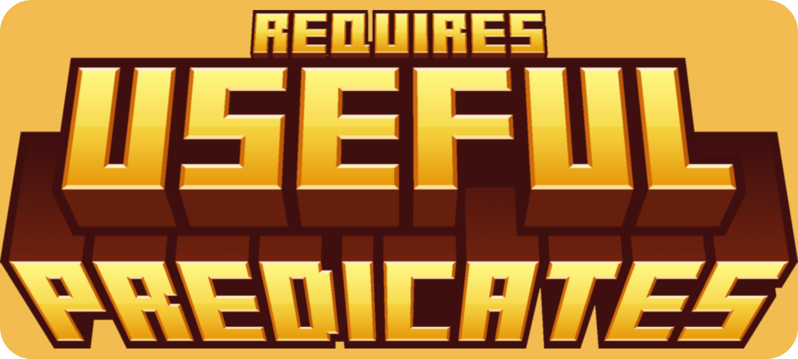

# Useful Predicates

> NOTE: Useful is a work in progress. More predicates are to be added when I feel like it. You can help me by contributing on GitHub.

**Useful** is a library for data pack developers that contains some predicates that you might need in your projects. It contains predicates for detecting player input, entity passengers, random chance and more!

## 🧾Predicates
If you don't already know, a **predicate** is a kind of file in data packs that you can use to check for many different things. You can find more info on predicates at the [Minecraft Wiki](https://minecraft.wiki/w/Predicate).

## 🌟Features
- Useful predicates for detecting different stuff.
- Open-source
- Open to suggestions

## 📁Download
### [🟢Modrinth](https://modrinth.com/datapack/useful-predicates)

## ✅Usage
> NOTE: to use the predicates in this library it must be installed! Any data packs made using it will not work unless the user has installed Useful!

You can access predicates from this library simply by using [``execute if predicate``](https://minecraft.wiki/w/Commands/execute#(if|unless)_predicate) followed by the predicate name. Visit the [project wiki](https://github.com/SashKom6/Useful-Predicates/wiki) for more info.

## 🖼️Badge
You can use the code below to insert a dependency badge linking to this library in any place that supports Markdown.

``

``

